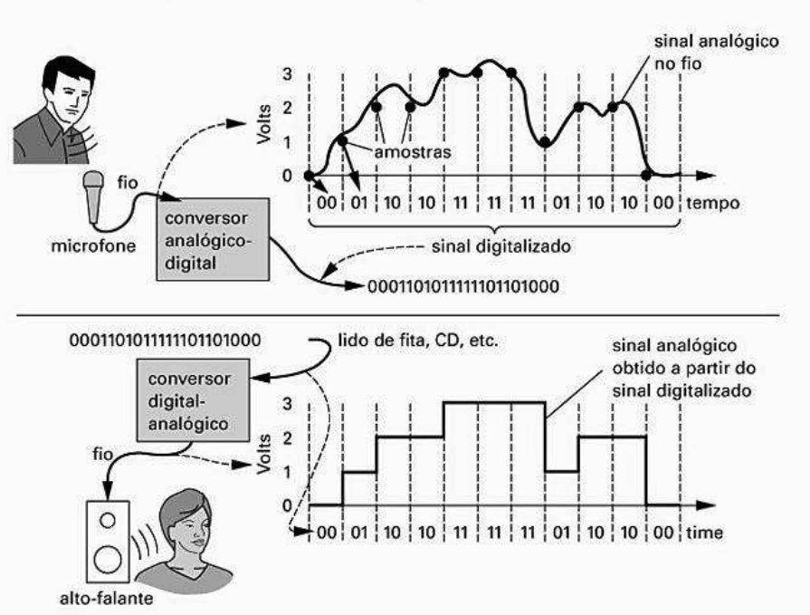
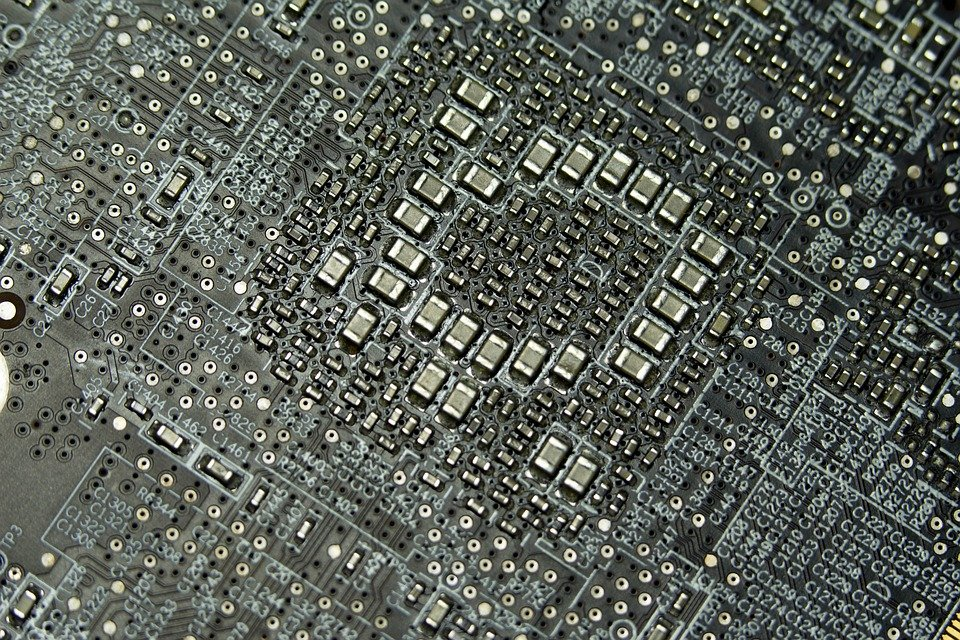
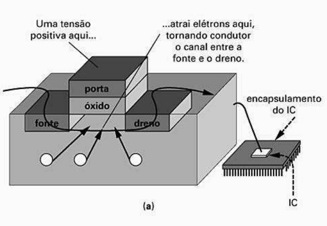
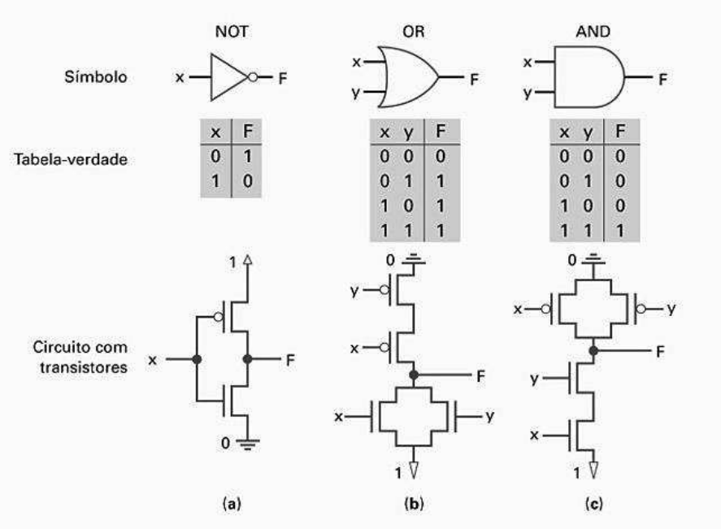

# Sistemas Digitais - Projetos de Otimização e HDLs

## Summary

This book shows us a deep study into the digital world, giving some tips about how it works at all.

## Introduction

When we talk about digital systems, we are talking about almost everything with technology that surrounds us, from medical tools to stuffs we find to be simple on our life, like our smartphone or even cameras.

## Signals

In the digital system world we have two common signals: **Digital** and **Analog**.

### Analog Signal

It was the first signal created and it is used even nowadays on some stuffs, per example: **Audio Recording, Audio Playing**, etc.

**This kinda signal can be represented with infinity values of volts** and because of that, **we usually lose quality and information on its transference** (since it can have lots of values and it is not possible to transfer all of them keeping its data without any lose).

### Digital Signal

**The main difference between analog and digital signal is that the digital can be represented only by two values** (per example 0 volts and 1 volt), what **helps maintaining quality and information during its transference** (since it has only two possible values, we are able to easily determine it when making transfers - if I receive 0.8 volts it probably means it was a 1 volt command, since it is closer to 1).

Being minded about it, **the digital signal works basically by sending binary values to its receptors**. Then, since only the format of the data changes from analog to digital, the analog signal can be converted into digital signal and vice-versa. That way, the digital signal can be used together with the analog on its implementations and can be used by itself on some others (that has only two representations by default).

### Transformation

</img>

## Logic Combination

A digital circuit which its outputs depend exclusively on a value combination of its inputs is called **Combinational Logic Circuit**.

</img>

### Switches

Switches are one of the reasons why we started implementing the digital signal, since when we are dealing with switches, we are basically managing if something has current going through it or not (what corresponds to the 0 and 1 of the binary system used by digital signals).

The switches help us handling almost all logic on our circuits. Because of that, the more switches we have on our circuits, the faster the circuits can make all possible calculations.

Usually the switches were used on IC (Integrated Circuits) and, the first switches were called **Relays** and they were extremely big.

In 1946, the first computer for general purpose (ENIAC) used to have 1500 relays to weights 27tons and to have 2,4 meters of height (it only to handle 1500 relays), being able to make 4500 operations per second.

After some years, new switches were created, they were called **Transistors** and they were too smaller than the old **Relays**. Besides, the transistors keep decreasing its size year by year (some have 100nm per example) and today, our personal computers have millions of them and we are able to make millions operations per second.
 
</img>

### CMOS Transistor

The most popular transistor used on Integrated Circuits are called CMOS and it uses a specific material to make the current transfer (usually something made of silicon, that needs a little current on it to turn into a conductor material and so, start the current transfer between the gates).

</img>

### Logic Gates

The logic gates are based on boolean algebra (a ecosystem of math that uses only false and true operators to solve problems). They were created since we needed a way to easily implement logic on our circuits (what we were not able to do only using CMOS by themselves).

The main operators used here are: **AND**, **OR** and **NOT**. Because of that we started implementing our logic gates following the same operators.

With help of CMOS Transistors, we are able to group them into logic gates, and so to use boolean logic to operate our circuits.

</img>