# Sistemas Digitais - Projetos de Otimização e HDLs

## Summary

This book shows us a deep study into the digital world, giving some tips about how it works at all.

## Introduction

When we talk about digital systems, we are talking about almost everything with technology that surrounds us, from medical tools to stuffs we find to be simple on our life, like our smartphone or even cameras.

---

# 1st Chapter

## Signals

In the digital system world we have two common signals: **Digital** and **Analog**.

### Analog Signal

It was the first signal created and it is used even nowadays on some stuffs, per example: **Audio Recording, Audio Playing**, etc.

**This kinda signal can be represented with infinity values of volts** and because of that, **we usually lose quality and information on its transference** (since it can have lots of values and it is not possible to transfer all of them keeping its data without any lose).

### Digital Signal

**The main difference between analog and digital signal is that the digital can be represented only by two values** (per example 0 volts and 1 volt), what **helps maintaining quality and information during its transference** (since it has only two possible values, we are able to easily determine it when making transfers - if I receive 0.8 volts it probably means it was a 1 volt command, since it is closer to 1).

Being minded about it, **the digital signal works basically by sending binary values to its receptors**. Then, since only the format of the data changes from analog to digital, the analog signal can be converted into digital signal and vice-versa. That way, the digital signal can be used together with the analog on its implementations and can be used by itself on some others (that has only two representations by default).

### Transformation

</img>

---

# 2nd Chapter

## Logic Combination

A digital circuit which its outputs depend exclusively on a value combination of its inputs is called **Combinational Logic Circuit**.

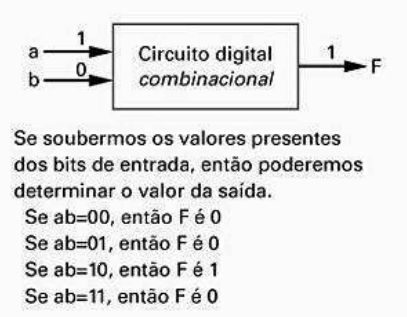</img>

### Switches

Switches are one of the reasons why we started implementing the digital signal, since when we are dealing with switches, we are basically managing if something has current going through it or not (what corresponds to the 0 and 1 of the binary system used by digital signals).

The switches help us handling almost all logic on our circuits. Because of that, the more switches we have on our circuits, the faster the circuits can make all possible calculations.

Usually the switches were used on IC (Integrated Circuits) and, the first switches were called **Relays** and they were extremely big.

In 1946, the first computer for general purpose (ENIAC) used to have 1500 relays to weights 27tons and to have 2,4 meters of height (it only to handle 1500 relays), being able to make 4500 operations per second.

After some years, new switches were created, they were called **Transistors** and they were too smaller than the old **Relays**. Besides, the transistors keep decreasing its size year by year (some have 100nm per example) and today, our personal computers have millions of them and we are able to make millions operations per second.
 
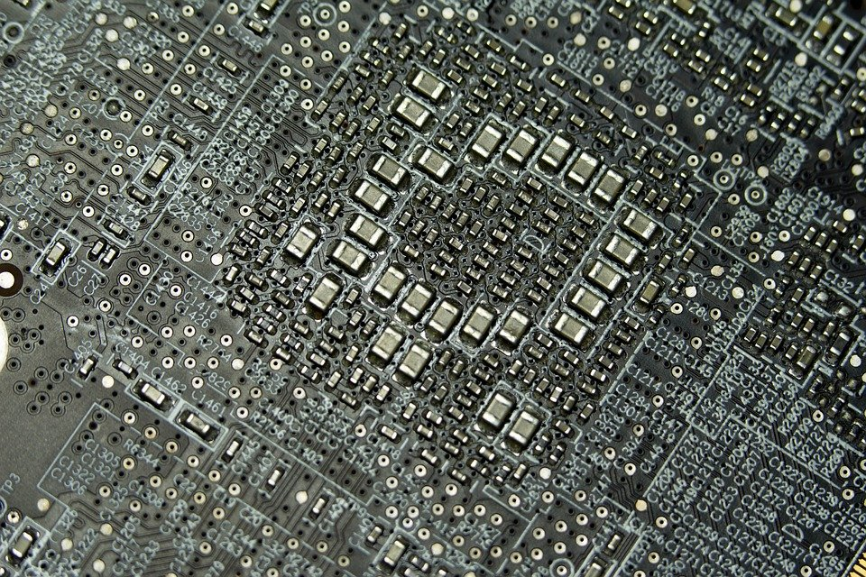</img>

### CMOS Transistor

The most popular transistor used on Integrated Circuits are called CMOS and it uses a specific material to make the current transfer (usually something made of silicon, that needs a little current on it to turn into a conductor material and so, start the current transfer between the gates).

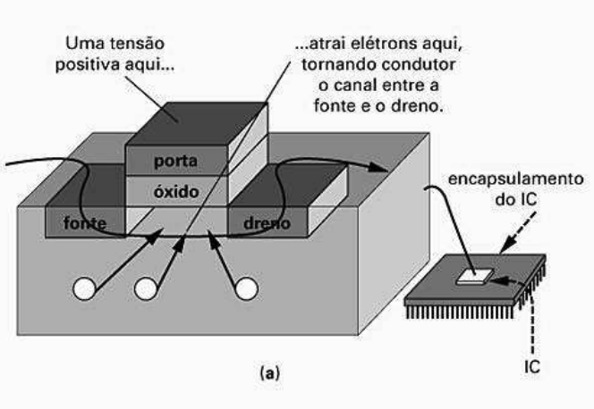</img>

### Logic Gates

The logic gates are based on boolean algebra (a ecosystem of math that uses only false and true operators to solve problems). They were created since we needed a way to easily implement logic on our circuits (what we were not able to do only using CMOS by themselves).

The main operators used here are: **AND**, **OR** and **NOT**. Because of that we started implementing our logic gates following the same operators.

With help of CMOS Transistors, we are able to group them into logic gates, and so to use boolean logic to operate our circuits.

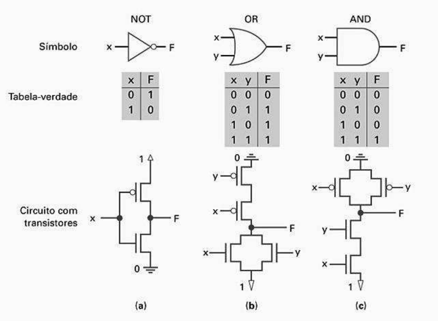</img>

### Boolean Algebra

The logic gates are pretty useful for implementing circuits, but the equations are better to manipulate these circuits. The boolean algebra tools help us manipulating boolean equations in order to simplify them, checking if two equations are the same, etc. That way, we can turn boolean equations into boolean gates easily.

Below you can see some properties that revolves around boolean algebra. Be aware that the letters can have a value of 0 or 1 since it is a boolean system.

**Operators notation in boolean algebra:**
> **NOT**(a) = **a'** or **ā**
> 
> a **OR** b = **a + b**
>
> a **AND** b = **ab** or **a * b**
> 
Example: w = (p AND NOT(s) AND k) OR t = ps'k + t

**Basic properties:**

1. Commutative
> a + b = b + a
>
> a * b = b * a

2. Distributive
> a * (b + c) = (a * b) + (a * c)
>
> a + (b * c) = (a + b) * (a + c)

3. Associative
> (a + b) + c = a + (b + c)
>
> (a * b) * c = a * (b * c)

4. Identity
> 0 + a = a + 0 = a
>
> 1 * a = a * 1 = a

5. Complement
> a + a' = 1
>
> a * a' = 0

**Additional properties:**

1. Null elements
> a + 1 = 1
>
> a * 0 = 0

2. Idempotence rule
> a + a = a
>
> a * a = a

3. Involution rule
> (a')' = a

4. DeMorgan rule
> (a + b)' = a'b'
>
> (ab)' = a' + b'

### Boolean Function Representations

A boolean function is basically a mapping for each of the possible function input combinations for some output (0 or 1).

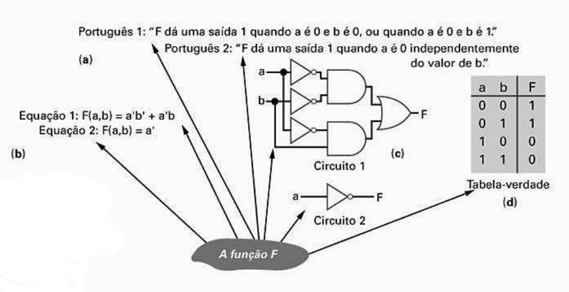</img>

We are able to represent the boolean functions with equations, circuits or even truth-tables.

Usually if we want to know if a **Function X** is equal to a **Function Y** we can do a truth-table compare, since a function can have only a single truth-table.

### The Logic Combination Project

Being minded about the idea we have got above, a simple way to make a logic combination can be:

**1. Capture the function:** Create a truth-table or equations to describe the desired behavior for the logic combination.

**2. Convert to equations:** This step is only needed if you created the function using a truth-table. Create an equation for every output using an OR operator with all minterms of that output (simplify the equations if needed).

**3. Implement a circuit based on gates:** For every output, create a correspondent circuit for this output equation (optionally you can share gates between the multiple outputs).

**Case Study:**

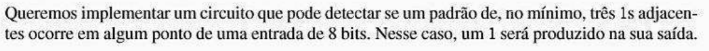</img>

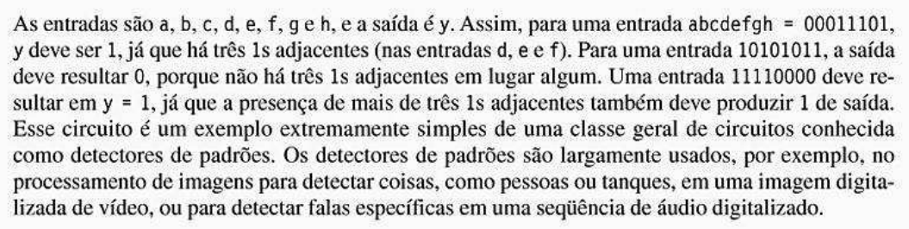</img>

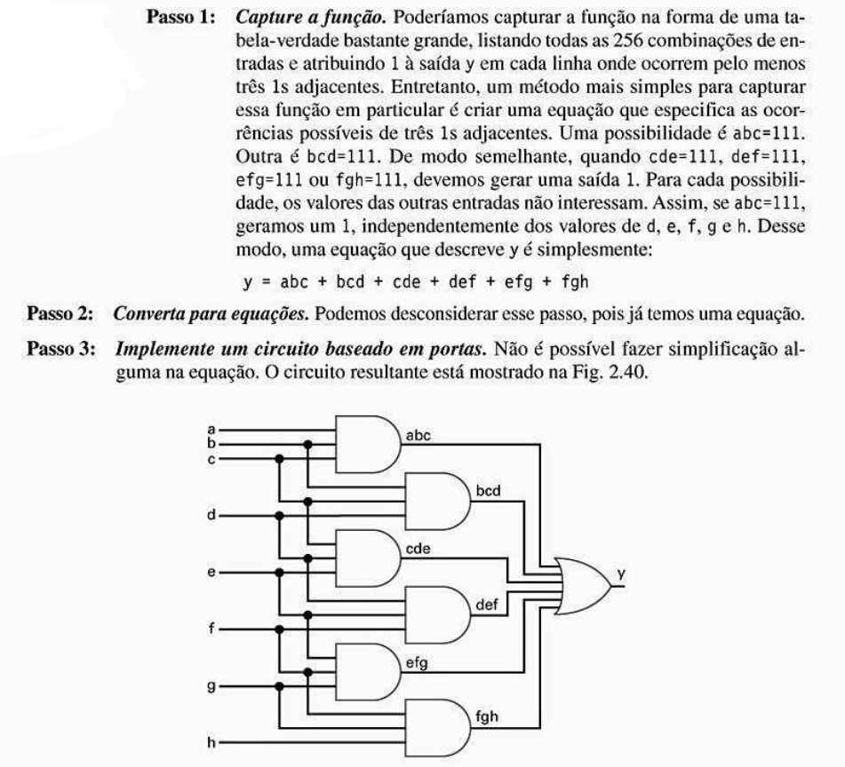</img>

### Decoders and Multiplexers

Decoders and multiplexers are digital circuit constructive blocks, even if they can be made using logic gates. 

**Decoder:** Decodes a binary number of a *n* bits input adding exactly one of the 2^*n* outputs of it in 1. 

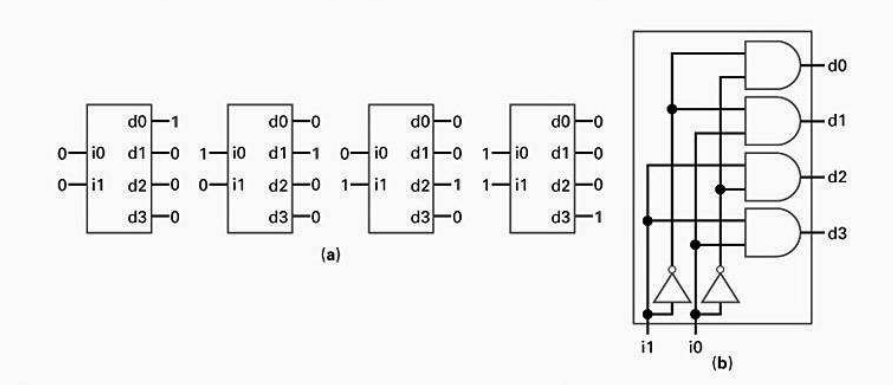</img>

**Multiplexer:** Works as a selector to enable only a single input to pass through an output (determines which input will get to the output).

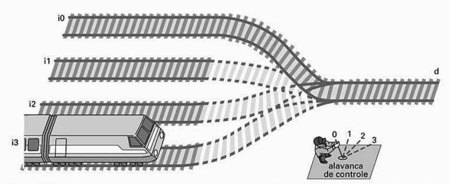</img>

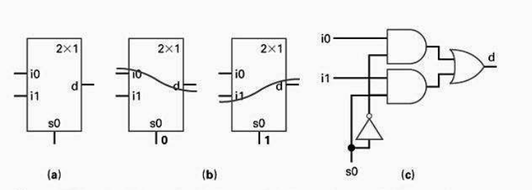</img>

---

# 3rd Chapter

## Sequential Logic

A digital circuit which its outputs depend on persistent bit values are called **Sequential Logic Circuit**.

## Bit Storage

When we are talking about bit persistence, we're saying that we are able to store a bit value inside a block and use it later. The basic method of storing bits is refeeding the system with its own return.

## Latch SR

This circuit is made of a pair of NOR switches with crossed interconnections. We can use this simple circuit in order to keep a value in state and implement some extra logics (like making something to work for some time [set] and stopping it later [reset]).

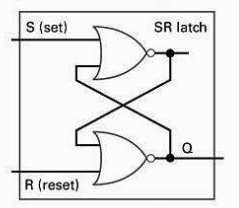</img>

One of the main issues of this circuit is that if **S** and **R** are 1 at the same time, some random action can happen in a loop till it reaches a final random value. Being minded about it, we never plug buttons directly to the Latch SR, instead we use a logic block before in order to force different values between [set] and [reset] actions, what does not happen in practice since the added switches have a delay by default and that delay can cause the two values to be the same sometimes.

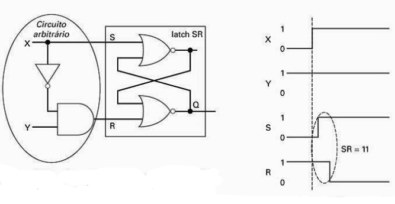</img>

In order to avoid the issues shown on the image above, we add can add a new item to circuit that will be able to determine if the action should work or not, that way we can make sure we only start some action after the circuit switch values are stable.

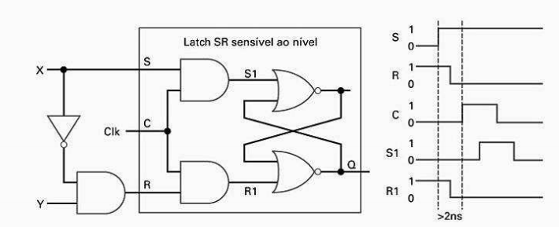</img>
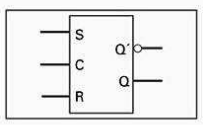</img>

## Clocks and synchrone circuits

In order to help enabling actions on memoized circuits only when the switches have stable values, we usually use a signal that pulses at a constant rate (that is what we call **clock**, the famous clock used by computer processors).

Generally we use something called as **oscillator** in order to help us using **clock** inside memoized circuits, its value varies from 0 to 1 in some period of time that is determined by its rate.

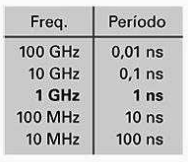</img>

## Flip-flop D

Since Latches usually stores the bit value **after** the clock value changes, it can lead to some bugs. Being minded about that, some circuits were created to solve that problem by storing the bit value **during** the clock value change. That way it gets harder to have two switches matching the same value.

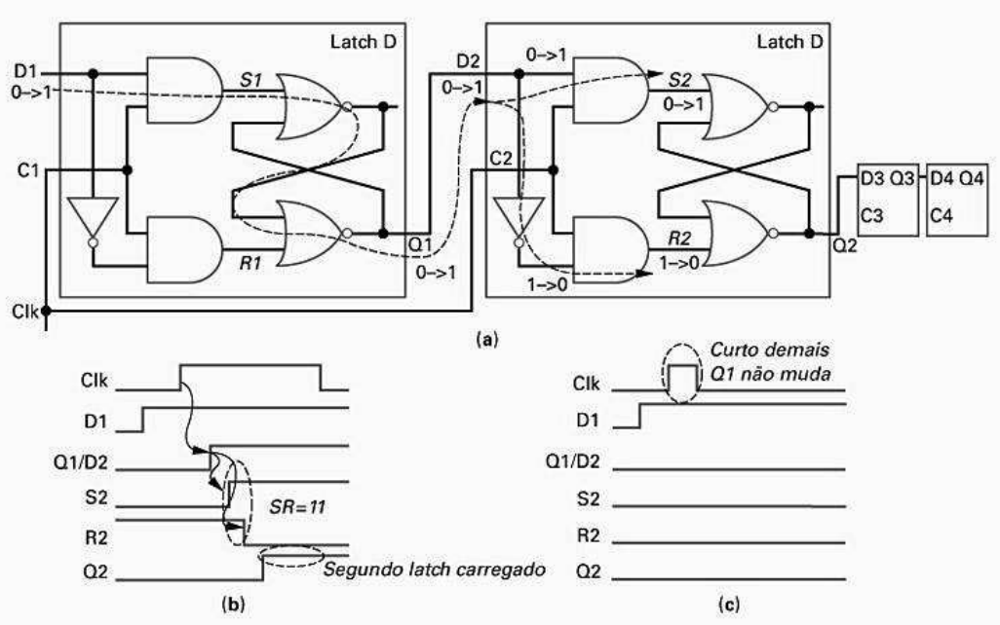</img>

## Latch vs Flip-flop

Being minded about the info above, we can differ latch from flip-flops by the idea:

- **Latch:** Sensible to level (it changes its value after the clock reached some value)

- **Flip-flop:** Sensible to border (it changes its value during clock value change)

## Multiple Bit Storage

Usually we use a **register** to store multiple bits, besides, we can make a **register** by joining multiple flip-flops. Below you can see an example of a 4-bit register.

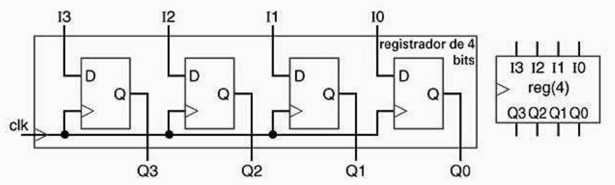</img>

## Finite State Machines

FSM is a basically a way to represent all states of a circuit. That way we are able to organize our circuit to work by transitioning into different kind of states.

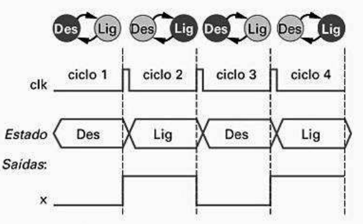</img>

There are a ot of ways of implementing a FSM circuit, but we can follow a basic pattern in order to replicate it easily to the most problems we find there. This pattern consists of a state register and a combinational logic, you can see it below:

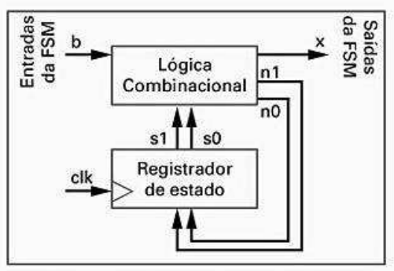</img>

A state register is a 2-bit register with a binary value that is equal to the current state (since it has 2 bits, it can represent a maximum amount of 4 states).

Being minded about the idea we have got above, a simple way to make a FSM can be:

**1. Capture the FSM:** Create a FSM that describes the circuit behavior.

**2. Create the Architecture:** Create a default architecture using a state register with the needed bits and a combinational logic, which inputs are register bits and FSM inputs and the outputs are the next state bits and FSM outputs.

**3. Code the states:** Give a binary number for each state (each state number is known as codification, it is like an ID for the state).

**4. Create a state table:** Create an truth table for the combinational logic in a way that the logic shows outputs and next state signal for the FSM.

**5. Implement the combinational logic:** Start implementing the combinational logic with any method you want.

Case Study:

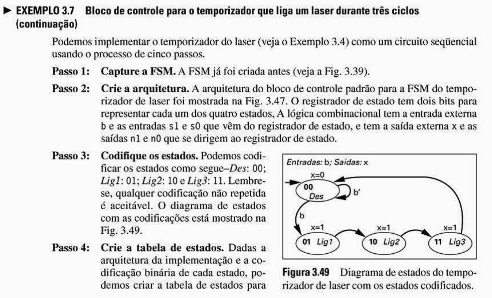</img>
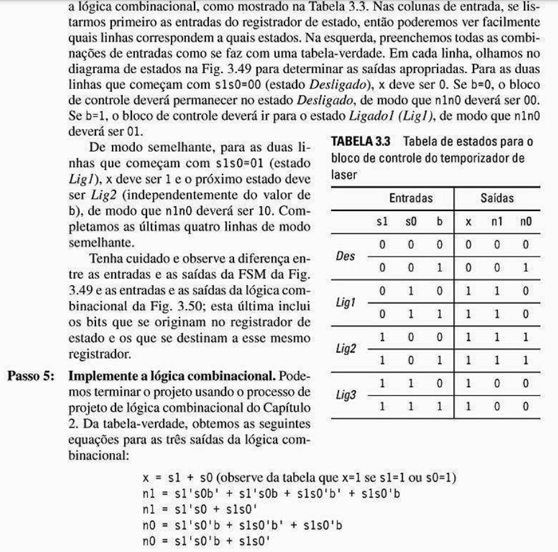</img>

---

# 4th Chapter

## Operational Block Components

This chapter is focused on implementing constructive blocks that are good for systems with data inputs and outputs.

## Registers

A register of N bits is a sequential component capable of storing N bits.

### Parallel charge register

That's the most simple register we can create, it consists of a group of flip-flops that are charged in each clock cycle.

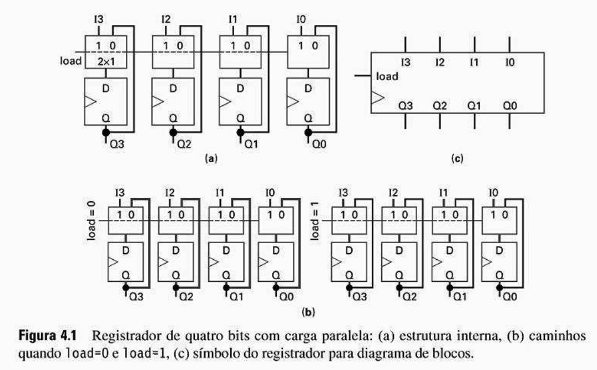</img>

Being minded about the idea we have got above, a simple way to make a register project can be:

**1. Determine the multiplexer size:** Get the function count and add a multiplexer in front of each flip-flop with at least these input count.

**2. Create the table of multiplexer functions:** Create a table of functions that defines the desired operations for every possible value of the multiplexer selector lines.

**3. Connect the multiplexer inputs:** For each function, connect the correct input of the multiplexer to the external input or the output of the correct flip-flop to get the desired function.

**4. Map all the control lines:** Create a truthy table that maps the external control lines into the internal ones of multiplexer selector, with correct priorities and so, project the combinational logic that implements that map.
